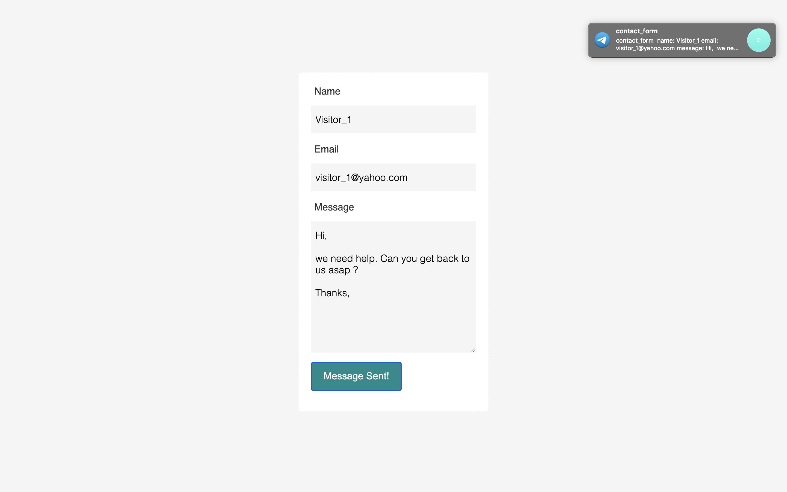

### Contact Form (Template)

You can use this form to test NoCodeAPI's telegram integration. A simple "POST" request to your NoCodeAPI's endpoint will send the data from this contact form to your Telegram bot.

1. Download this form
2. Create your Telegram bot.
3. Create your NoCodeAPI telegram endpoint
4. Update "index.html" file with your NoCodeAPI_telegram Endpoint
5. Open "index.html" in your browser.
6. Update input fields and click Submit. 

You should receive a message on Telegram bot.
